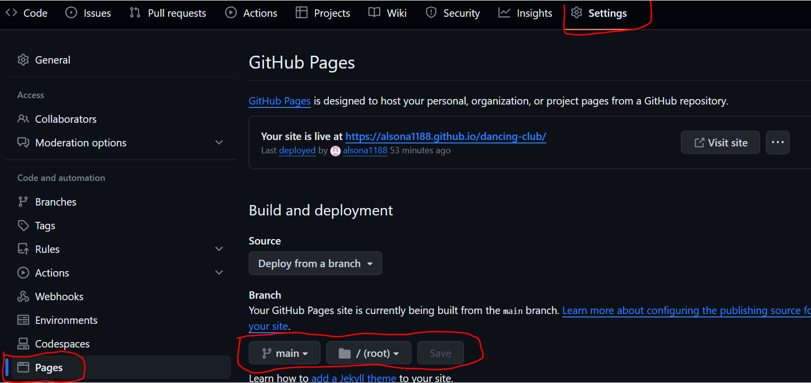

# [Dancing club](https://alsona1188.github.io/dancing-club/)

The **Dancing club** website is regarding a dancing course based in Stuttgart. The course is open for all the people that are interested to learn tango, bachata or wedding classes and are above 6 years old. 
Users of this website will find a general information about type of classes does the course offers and also who can register for these classes. 

 

 

## Features

- __Navigation bar__

 - Featured at the top of the page shows the name of the club. The navigation shows the club name in the left corner DANCING CLUB that links to the top of the page.
 - The other navigation are to the right: Home, About us and Sign Up, which links to defferent pages.
 - When you click on the logo of the page Dancing club, it will bring you to the home page.

  

 

- **The main Photo**

  - The main photo includes a photograph with a nice quote.
  - This section introduces the user to Dancing Club with an eye catching animation to grab their attention. As soon as you open the website, the user has a clear idea of what is the website for.

 

- **The dance classes**

  - This section shows the viewers what dance classes are offered in the school.
  - There are 3 classes that are offered from the school, wedding classes, bachata and tango.

 

- **Who can register**

  - This section shows who can register to the dance classes.
  - The classes are for everyone that is above 6 years old. The cources are devided for kids, individual and wedding classes.

 

- **The Footer**

  - The footer section includes links to the relevant social media sites for Dancing club. The links will open to a new tab to allow easy navigation for the user.
  - The footer is valuable to the user as it encourages them to keep connected via social media
  - In the footer section the user will fing the address and also it is clickable to a new page in google map.
  - Email and phone contact are also in the footer section.

 

- **About Us**
  
  - This section shows the users the values of the school and the founder of the school. She is also the main teacher specialized for the wedding courses.

  - In this section there is a gallery of photos from different groups.
  

- **The Sign Up Page**

  - This page will allow the user to get signed up to Dancing Club to start their dancing journey with the community. The user will be able specify if they would like to regiter for kids, individuals or wedding courses.
  

 

## Testing

- I tested that this page works in different browsers: Crome, Firefox, Safari.
- I confirmed that this project is responsive, looks good and functions on all standard screen sizes using the devtools device toolbar.
- I confirm that the form works: requires entries in every field and the submit button works.

 

### Validator Testing and Lighthouse

- HTML
  - No errors were returned when passing through the official W3C validator.
  
   
  

 

- CSS
  - No errors were found when passing through the official Jigsaw validator.
 

 

- Lighthouse
  - Performance - How the page performs whilst loading.
  - Accessibility - Is the site acccessible for all users and how can it be improved.
  - Best Practices - Site conforms to industry best practices.
  - SEO - Search engine optimisation. Is the site optimised for search engine result rankings.
  
  
  
   
  

## Deployment
 

This section should describe the process you went through to deploy the project to a hosting platform (e.g. GitHub)

- The site was deployed to GitHub pages. The steps to deploy are as follows:
  - In the GitHub repository, navigate to the Settings tab
  - From the source section drop-down menu, select the main Branch
  - Once the main branch has been selected, the page will be automatically refreshed with a detailed ribbon display to indicate the successful deployment.

The live link can be found here - [Dancing Club](https://alsona1188.github.io/dancing-club/index.html)

 

### **To create a local clone of this project**

The method from cloning a project from GitHub is below:

1. Under the repository’s name, click on the **code** tab.
2. In the **Clone with HTTPS** section, click on the clipboard icon to copy the given URL.
3. In your IDE of choice, open **Git Bash**.
4. Change the current working directory to the location where you want the cloned directory to be made.
5. Type **git clone**, and then paste the URL copied from GitHub.
6. Press **enter** and the local clone will be created.

## Credits
 

### Content

- The text for the bachata, tango and wedding classes were taken from wikipedia and the website [Bella Ballroom](https://www.bellaballroom.com/dance-lessons/ballroom-dancing/tango/)
- Instructions on how to implement form validation on the Sign Up page was taken from the Running Club.  
- The icons in the footer were taken from [Font Awesome](https://fontawesome.com/)
- The About us content was taken from [Bella Ballroom](https://www.bellaballroom.com/dance-lessons/ballroom-dancing/tango/)
  
   

### Media

- The photos used on the website are taken from [Freepik](https://www.freepik.com/search?format=search&page=7&query=latin+dance+group+people&type=photo)

 

# Acknowledgements

The site was completed as a Portfolio 1 Project piece for the Full Stack Software Developer Diploma at the [Code Institute](https://codeinstitute.net/). As such I would like to thank my mentor [Precious Ijege](https://www.linkedin.com/in/precious-ijege-908a00168/), the Slack community, and all at the Code Institute for their help and support. 

Alsona Natsi 2023.

